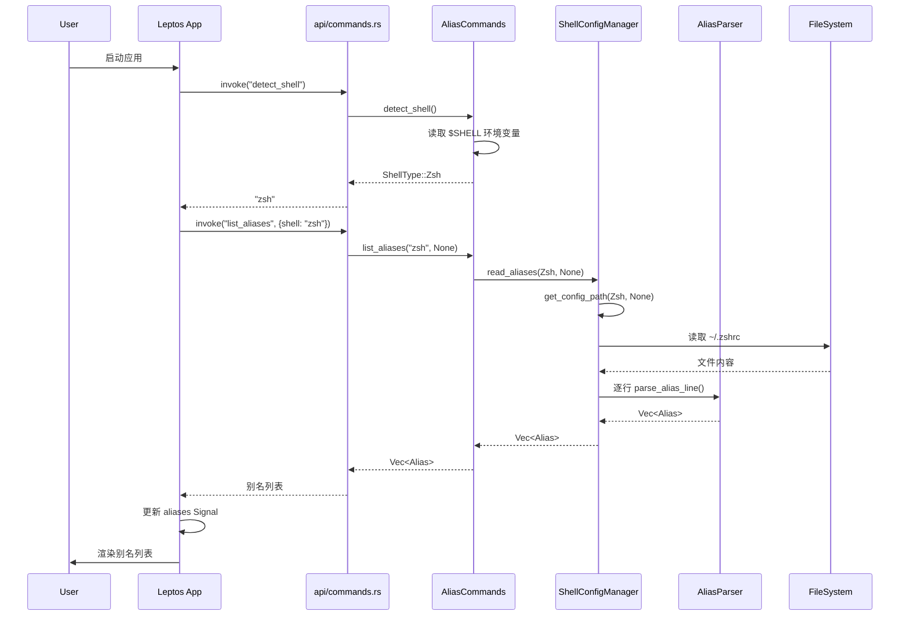
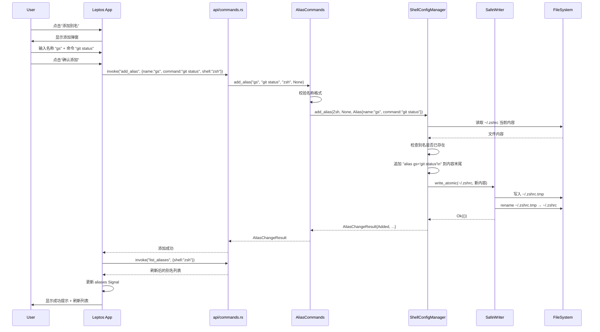
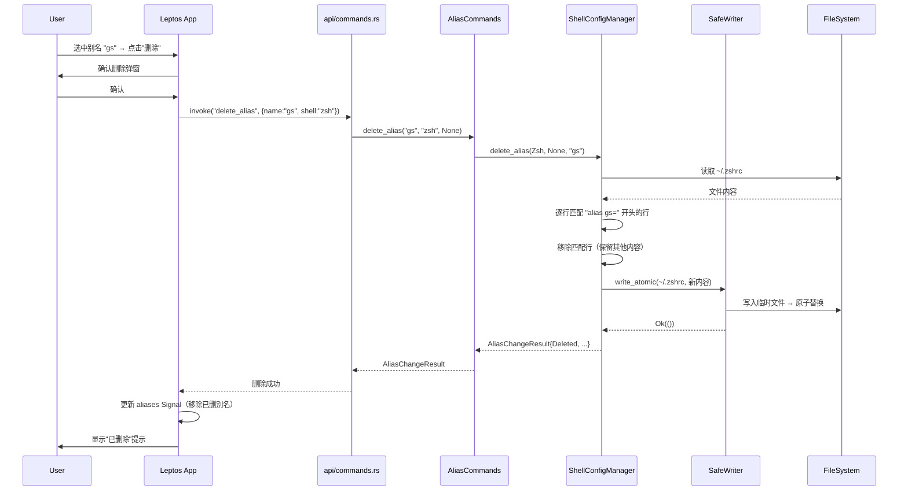
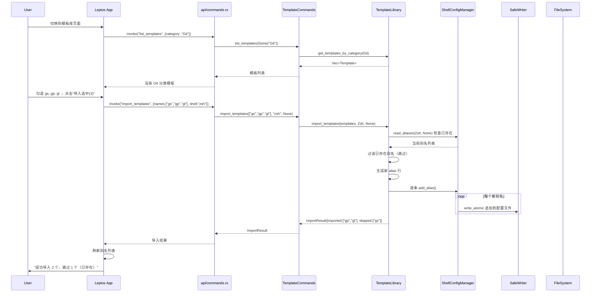
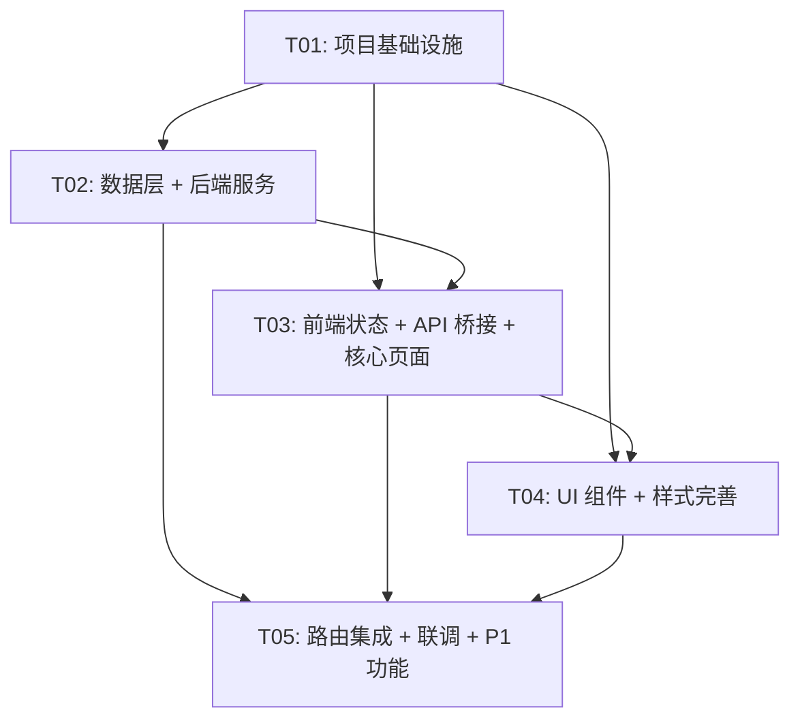

# rs-alias-manager 系统架构设计

## Part A：系统设计

---

### 1. 实现方案 + 框架选型

#### 1.1 核心技术挑战

| 挑战 | 分析 | 应对策略 |
|------|------|----------|
| Rust 前端框架选型 | 用户要求 Rust 前端（学习 Rust），需选一个与 Tauri v2 兼容、生态成熟的框架 | 选用 Leptos 0.8（详见下方分析） |
| 配置文件安全操作 | shell 配置文件包含非别名内容，损坏将影响用户环境 | 行级增删 + 临时文件原子替换策略 |
| 别名解析准确性 | `.bashrc`/`.zshrc` 格式灵活（单引号/双引号/无引号、多行 alias） | MVP 仅解析 `alias xxx=yyy` 格式的单行别名 |
| Tauri 前后端通信 | Rust 前端（WASM）与 Tauri 后端（Native Rust）需通过 `invoke` 桥接 | 使用 `wasm-bindgen` + `withGlobalTauri` 模式 |
| 多 Shell 差异 | bash/zsh 配置路径和语法略有差异 | 抽象 ShellType 枚举，按类型分发配置路径 |

#### 1.2 Rust 前端框架选型分析

| 维度 | Leptos 0.8 | Dioxus 0.6 | Yew 0.21 |
|------|-----------|------------|----------|
| **Tauri v2 官方支持** | ✅ 有官方集成指南 | ❌ 无官方指南（Dioxus 自带桌面渲染器，与 Tauri 定位重叠） | ❌ 无官方指南 |
| **编程模型** | 细粒度响应式（Signal），类似 SolidJS | 组件模型（Hooks），类似 React | 组件模型（Hooks），类似 React |
| **SSG 支持** | ✅ 原生支持 SSG 模式，适合 Tauri | ✅ 支持 | ⚠️ 需额外配置 |
| **生态成熟度** | 高：Leptos-Use、Leptos-Router、VSCode 扩展 | 高：跨平台生态完善 | 中：生态相对老化 |
| **学习价值** | 学习 Rust 响应式范式，与 Tauri 生态深度结合 | 更接近 React，但与 Tauri 集成需更多自定义 | 社区活跃度下降 |
| **热重载** | ✅ Trunk + Leptos 热重载 | ✅ Dioxus 自带热重载 | ⚠️ 需 Trunk |
| **构建工具** | Trunk（成熟稳定） | Dioxus CLI（自带） | Trunk |

**推荐：Leptos 0.8**

理由：
1. **Tauri v2 官方支持** — 官方文档提供完整的 Leptos 集成指南，降低踩坑风险
2. **SSG 模式成熟** — 与 Tauri 的 webview 渲染模型天然契合
3. **细粒度响应式** — 性能优秀，更新粒度更细，无需虚拟 DOM diff
4. **学习价值高** — Signal 模型是 Rust 前端的前沿范式，与 SolidJS 理念一致
5. **社区活跃** — 0.8 稳定版持续迭代，0.9 alpha 已在开发中

> **不选 Dioxus 的原因**：Dioxus 自带桌面渲染器（基于 tao+wry，与 Tauri 底层相同），与 Tauri 组合使用存在功能重叠和集成复杂度。Dioxus 更适合独立使用其自己的桌面渲染器，而非嵌入 Tauri。

#### 1.3 CSS 方案选型

| 方案 | 优点 | 缺点 |
|------|------|------|
| Vanilla CSS | 零依赖、完全控制 | 样式复用差、无工具链支持 |
| Tailwind CSS | 原子化 CSS、开发效率高 | 需 Node.js 工具链、增加构建复杂度 |
| **Vanilla CSS + CSS Custom Properties** | 零依赖、主题变量支持、轻量 | 需手写样式 |

**推荐：Vanilla CSS + CSS Custom Properties**

理由：
1. 项目 UI 规模有限（三页面），无需引入 Tailwind 的 Node.js 构建链
2. CSS Custom Properties 原生支持主题切换（P2-5 深色/浅色主题）
3. 保持纯 Rust 工具链（cargo + trunk），无需 npm/yarn
4. 学习 Rust 的用户不应被前端构建工具链分散注意力

#### 1.4 整体技术栈确认

| 层级 | 技术 | 版本 |
|------|------|------|
| 桌面框架 | Tauri | v2.11.x |
| 前端框架 | Leptos | 0.8.x |
| 前端构建 | Trunk | 最新稳定版 |
| 前端路由 | leptos_router | 0.8.x |
| CSS | Vanilla CSS + CSS Custom Properties | — |
| 后端语言 | Rust | stable (1.80+) |
| 序列化 | serde + serde_json | 最新稳定版 |
| 错误处理 | thiserror | 最新稳定版 |
| 目标平台 | macOS + Linux | — |

#### 1.5 架构模式

采用 **Tauri 标准双层架构**：

```
┌─────────────────────────────────────────────┐
│              Tauri Window (WebView)          │
│  ┌───────────────────────────────────────┐  │
│  │    Leptos Frontend (WASM)             │  │
│  │    - UI 组件渲染                       │  │
│  │    - Signal 状态管理                    │  │
│  │    - leptos_router 路由               │  │
│  └───────────────┬───────────────────────┘  │
│                  │ invoke()                  │
│  ┌───────────────▼───────────────────────┐  │
│  │    Tauri Commands (Native Rust)       │  │
│  │    - ShellConfigManager              │  │
│  │    - AliasParser                     │  │
│  │    - TemplateLibrary                 │  │
│  │    - AppSettings                     │  │
│  └───────────────────────────────────────┘  │
└─────────────────────────────────────────────┘
```

**前端职责**：UI 渲染、用户交互、Signal 状态管理、路由
**后端职责**：文件 I/O、别名解析、配置写入、Shell 检测、模板数据

---

### 2. 文件列表及相对路径

```
rs-alias-manager/
├── Cargo.toml                          # Workspace 根配置
├── Trunk.toml                          # Trunk 构建配置
├── index.html                          # 前端入口 HTML
├── style.css                           # 全局样式
│
├── src/                                # Leptos 前端源码
│   ├── main.rs                         # 前端入口（mount App）
│   ├── app.rs                          # 根组件 + 路由定义
│   ├── components/
│   │   ├── sidebar.rs                  # 左侧导航栏组件
│   │   ├── alias_list.rs               # 别名列表组件
│   │   ├── alias_form.rs               # 添加/编辑别名弹窗组件
│   │   ├── search_bar.rs               # 搜索框组件
│   │   ├── template_list.rs            # 模板列表组件
│   │   ├── template_category_tabs.rs   # 模板分类标签组件
│   │   └── settings_form.rs            # 设置表单组件
│   ├── pages/
│   │   ├── alias_page.rs               # 别名管理页面
│   │   ├── template_page.rs            # 模板库页面
│   │   └── settings_page.rs            # 设置页面
│   ├── state/
│   │   └── app_state.rs                # 全局 Signal 状态定义
│   └── api/
│       └── commands.rs                 # Tauri invoke 封装（前端侧）
│
├── src-tauri/                          # Tauri 后端源码
│   ├── Cargo.toml                      # 后端依赖配置
│   ├── tauri.conf.json                 # Tauri 配置文件
│   ├── build.rs                        # Tauri 构建脚本
│   ├── capabilities/
│   │   └── default.json                # Tauri 权限声明
│   └── src/
│       ├── main.rs                     # Tauri 入口（启动应用）
│       ├── lib.rs                      # Tauri 模块声明 + 注册 commands
│       ├── commands/
│       │   ├── mod.rs                  # commands 模块声明
│       │   ├── alias_cmds.rs           # 别名 CRUD 命令
│       │   ├── template_cmds.rs        # 模板相关命令
│       │   └── settings_cmds.rs        # 设置相关命令
│       ├── models/
│       │   ├── mod.rs                  # models 模块声明
│       │   ├── alias.rs                # Alias 数据模型
│       │   ├── shell_type.rs           # ShellType 枚举
│       │   └── template.rs             # Template 数据模型
│       ├── services/
│       │   ├── mod.rs                  # services 模块声明
│       │   ├── shell_config.rs         # Shell 配置文件读写服务
│       │   ├── alias_parser.rs         # 别名解析器
│       │   ├── safe_writer.rs          # 安全写入（临时文件+原子替换）
│       │   ├── template_library.rs     # 内置模板库数据
│       │   └── app_settings.rs         # 应用设置持久化
│       └── error.rs                    # 统一错误类型定义
│
└── docs/
    ├── architecture.md                 # 本文档
    ├── sequence-diagram.mermaid        # 时序图
    └── class-diagram.mermaid           # 类图
```

---

### 3. 数据结构和接口（类图）

```mermaid
classDiagram
    direction TB

    %% ===== 数据模型 =====
    class ShellType {
        <<enumeration>>
        Bash
        Zsh
        Fish
        +config_path() String
        +source_command() String
        +from_env() ShellType
        +from_str(s: &str) ShellType
    }

    class Alias {
        +name: String
        +command: String
        +tags: Vec~String~
        +to_alias_line() String
        +from_alias_line(line: &str) Option~Alias~
    }

    class AliasAction {
        <<enumeration>>
        Added
        Updated
        Deleted
    }

    class AliasChangeResult {
        +action: AliasAction
        +alias: Alias
        +message: String
    }

    class TemplateCategory {
        <<enumeration>>
        Git
        Docker
        FileOps
        Network
        Custom
        +label() &str
        +all() Vec~TemplateCategory~
    }

    class Template {
        +name: String
        +command: String
        +description: String
        +category: TemplateCategory
    }

    class ImportResult {
        +imported: Vec~String~
        +skipped: Vec~String~
        +failed: Vec~String~
    }

    class AppConfig {
        +shell_type: ShellType
        +custom_config_path: Option~String~
        +auto_refresh: bool
        +auto_source: bool
    }

    class AppError {
        <<enumeration>>
        IoError(String)
        ParseError(String)
        ConfigNotFound(String)
        AliasExists(String)
        AliasNotFound(String)
        InvalidAliasName(String)
        +to_string() String
    }

    %% ===== 后端服务 =====
    class ShellConfigManager {
        +read_aliases(shell: ShellType, path: Option~String~) Result~Vec~Alias~~
        +add_alias(shell: ShellType, path: Option~String~, alias: Alias) Result~AliasChangeResult~~
        +update_alias(shell: ShellType, path: Option~String~, old_name: String, alias: Alias) Result~AliasChangeResult~~
        +delete_alias(shell: ShellType, path: Option~String~, name: String) Result~AliasChangeResult~~
        +get_config_path(shell: ShellType, custom: Option~String~) PathBuf
    }

    class AliasParser {
        +parse_alias_line(line: &str) Option~Alias~
        +serialize_alias(alias: &Alias) String
        +is_alias_line(line: &str) bool
    }

    class SafeWriter {
        +write_atomic(path: &Path, content: &str) Result~()~
    }

    class TemplateLibrary {
        +get_all_templates() Vec~Template~
        +get_templates_by_category(cat: TemplateCategory) Vec~Template~
        +import_templates(templates: Vec~Template~, shell: ShellType, path: Option~String~) Result~ImportResult~~
    }

    class SettingsManager {
        +load_settings() Result~AppConfig~
        +save_settings(config: &AppConfig) Result~()~
        +get_default_config_path() PathBuf
    }

    %% ===== Tauri Command 接口 =====
    class AliasCommands {
        +list_aliases(shell: &str, path: Option~String~) Result~Vec~Alias~, AppError~
        +add_alias(name: &str, command: &str, shell: &str, path: Option~String~) Result~AliasChangeResult, AppError~
        +update_alias(old_name: &str, name: &str, command: &str, shell: &str, path: Option~String~) Result~AliasChangeResult, AppError~
        +delete_alias(name: &str, shell: &str, path: Option~String~) Result~AliasChangeResult, AppError~
        +detect_shell() Result~String, AppError~
    }

    class TemplateCommands {
        +list_templates(category: Option~String~) Vec~Template~
        +import_templates(names: Vec~String~, shell: &str, path: Option~String~) Result~ImportResult, AppError~
    }

    class SettingsCommands {
        +get_settings() Result~AppConfig, AppError~
        +update_settings(config: AppConfig) Result~(), AppError~
        +get_config_file_path(shell: &str) Result~String, AppError~
    }

    %% ===== 前端组件 =====
    class AppState {
        +aliases: Signal~Vec~Alias~~
        +shell_type: Signal~ShellType~
        +config_path: Signal~String~
        +search_query: Signal~String~
        +selected_aliases: Signal~HashSet~String~~
        +loading: Signal~bool~
        +error_message: Signal~Option~String~~
    }

    %% ===== 关系 =====
    ShellType --> Alias : 配置路径
    Alias --> AliasParser : 解析/序列化
    Alias --> ShellConfigManager : CRUD 操作
    ShellConfigManager --> AliasParser : 使用
    ShellConfigManager --> SafeWriter : 使用
    TemplateLibrary --> AliasParser : 导入时使用
    TemplateLibrary --> ShellConfigManager : 导入时写入
    SettingsManager --> AppConfig : 持久化
    AliasCommands --> ShellConfigManager : 委托
    TemplateCommands --> TemplateLibrary : 委托
    SettingsCommands --> SettingsManager : 委托
    AppState --> Alias : 列表数据
    AppState --> ShellType : 当前 Shell
```



---

### 4. 程序调用流程（时序图）

#### 4.1 别名列表加载流程



#### 4.2 添加别名流程



#### 4.3 删除别名流程



#### 4.4 模板导入流程



---

### 5. 待明确事项

| 编号 | 事项 | 影响范围 | 建议处理方式 |
|------|------|----------|-------------|
| A1 | Leptos 0.8 与 Tauri v2.11 的 `withGlobalTauri` 模式下，`invoke` 的 WASM 绑定具体用法需在开发时验证 | 前端 API 调用层 | 首个任务中包含技术验证步骤 |
| A2 | Tauri v2 权限模型（capabilities）对文件系统访问的限制需确认 | 安全写入、设置持久化 | 需声明 `fs:default` 和 `path:default` 权限 |
| A3 | 应用自身设置（AppConfig）的持久化路径：使用 Tauri 的 `app_data_dir` 还是自定义路径 | 设置管理 | 使用 Tauri 的 `app_data_dir` API |
| A4 | Leptos 0.8 的 Signal 在 WASM 中与 `wasm-bindgen` 的兼容性需验证 | 状态管理 | Leptos 官方支持，风险低 |
| A5 | 别名行解析需处理 `alias name='command'`、`alias name="command"`、`alias name=command` 三种引号格式 | 别名解析器 | 在 AliasParser 中统一处理 |

---

## Part B：任务分解

---

### 6. 依赖包列表

#### 前端 Cargo.toml（项目根目录）

```toml
[dependencies]
leptos = { version = "0.8", features = ["csr"] }
leptos_router = "0.8"
leptos_meta = "0.8"
wasm-bindgen = "0.2"
wasm-bindgen-futures = "0.4"
js-sys = "0.3"
serde = { version = "1", features = ["derive"] }
serde_json = "1"
serde-wasm-bindgen = "0.6"
log = "0.4"
console_log = "1"

[dependencies.web-sys]
version = "0.3"
features = ["Window"]
```

> 注：Leptos CSR（Client-Side Rendering）模式，因为 Tauri 在 WebView 中运行前端。

#### 后端 Cargo.toml（src-tauri/）

```toml
[dependencies]
tauri = { version = "2", features = [] }
tauri-plugin-fs = "2"
tauri-plugin-dialog = "2"
tauri-plugin-shell = "2"
serde = { version = "1", features = ["derive"] }
serde_json = "1"
thiserror = "2"
dirs = "6"

[build-dependencies]
tauri-build = "2"
```

---

### 7. 任务列表（按依赖顺序排列）

| Task ID | Task Name | 描述 | 涉及文件 | 依赖 | 优先级 |
|---------|-----------|------|----------|------|--------|
| T01 | 项目基础设施 | 初始化 Tauri v2 + Leptos 0.8 项目结构：配置文件（Cargo.toml、tauri.conf.json、Trunk.toml、capabilities）、入口文件（index.html、main.rs 前后端）、lib.rs 模块声明、全局样式（style.css）、app.rs 骨架 | `Cargo.toml`, `Trunk.toml`, `index.html`, `style.css`, `src-tauri/Cargo.toml`, `src-tauri/tauri.conf.json`, `src-tauri/build.rs`, `src-tauri/capabilities/default.json`, `src-tauri/src/main.rs`, `src-tauri/src/lib.rs`, `src/main.rs`, `src/app.rs` | 无 | P0 |
| T02 | 数据层 + 后端服务 | 实现核心数据模型（Alias、ShellType、Template、AppConfig、AppError）和后端服务（ShellConfigManager、AliasParser、SafeWriter、TemplateLibrary、SettingsManager）及 Tauri Commands 注册 | `src-tauri/src/models/mod.rs`, `src-tauri/src/models/alias.rs`, `src-tauri/src/models/shell_type.rs`, `src-tauri/src/models/template.rs`, `src-tauri/src/services/mod.rs`, `src-tauri/src/services/shell_config.rs`, `src-tauri/src/services/alias_parser.rs`, `src-tauri/src/services/safe_writer.rs`, `src-tauri/src/services/template_library.rs`, `src-tauri/src/services/app_settings.rs`, `src-tauri/src/commands/mod.rs`, `src-tauri/src/commands/alias_cmds.rs`, `src-tauri/src/commands/template_cmds.rs`, `src-tauri/src/commands/settings_cmds.rs`, `src-tauri/src/error.rs` | T01 | P0 |
| T03 | 前端状态 + API 桥接 + 核心页面组件 | 实现前端全局状态（AppState Signal）、Tauri invoke 封装（api/commands.rs）、以及三个页面组件（alias_page、template_page、settings_page） | `src/state/app_state.rs`, `src/api/commands.rs`, `src/pages/alias_page.rs`, `src/pages/template_page.rs`, `src/pages/settings_page.rs` | T01, T02 | P0 |
| T04 | UI 组件 + 样式完善 | 实现所有 UI 组件（sidebar、alias_list、alias_form、search_bar、template_list、template_category_tabs、settings_form）并完善全局样式（含 CSS Custom Properties 主题变量） | `src/components/sidebar.rs`, `src/components/alias_list.rs`, `src/components/alias_form.rs`, `src/components/search_bar.rs`, `src/components/template_list.rs`, `src/components/template_category_tabs.rs`, `src/components/settings_form.rs`, `style.css` | T01, T03 | P0 |
| T05 | 路由集成 + 联调 + P1 功能 | 集成路由（leptos_router）、组件组合到 App、端到端联调、实现 P1 功能（搜索过滤、导出/导入 JSON、多 Shell 切换）、修复集成问题 | `src/app.rs`, `src/pages/alias_page.rs`, `src/pages/template_page.rs`, `src/pages/settings_page.rs`, `src/state/app_state.rs`, `src-tauri/src/commands/alias_cmds.rs`, `src-tauri/src/commands/template_cmds.rs`, `src-tauri/src/commands/settings_cmds.rs` | T01, T02, T03, T04 | P1 |

---

### 8. 共享知识（跨文件约定）

#### 8.1 错误处理策略

```
- 后端所有 Command 返回 Result<T, AppError>，AppError 使用 thiserror 派生
- AppError 枚举变体：IoError / ParseError / ConfigNotFound / AliasExists / AliasNotFound / InvalidAliasName
- 前端通过 invoke 的 .catch() 捕获错误，更新 error_message Signal
- 不使用 panic，所有文件操作均返回 Result
- 错误信息面向开发者（英文），用户界面展示中文翻译
```

#### 8.2 命名约定

```
- Tauri Command 函数：snake_case，如 list_aliases, add_alias
- Leptos 组件：PascalCase，如 AliasList, AliasForm
- Signal 变量：snake_case，如 aliases, search_query
- CSS 类名：kebab-case，如 alias-list, sidebar-nav
- CSS Custom Properties：--prefix-variant，如 --color-primary, --bg-surface
- Rust 模块文件：snake_case，如 alias_parser.rs, shell_config.rs
```

#### 8.3 配置文件操作规范

```
- 读取：直接读取目标文件，如不存在返回空列表（不报错）
- 写入：SafeWriter — 先写入同目录临时文件，再 fs::rename 原子替换
- 行级操作：仅增删改以 "alias " 开头的行，保留所有非 alias 行
- 备份：写入前不创建 .bak 备份（原子替换已保证安全性）
- 编码：UTF-8
- 换行符：保留原文件换行符风格（Unix LF）
```

#### 8.4 前后端通信协议

```
- 所有 invoke 调用通过 src/api/commands.rs 统一封装
- 参数传递：使用 JSON 序列化（serde），前端构造参数对象
- 返回格式：
  - 成功：Result<T, AppError> 的 Ok(T)
  - 失败：Result<T, AppError> 的 Err(AppError)，前端从 error 字段提取错误信息
- Shell 类型传递：使用字符串 "bash" | "zsh" | "fish"，后端 from_str 解析
- 所有 Tauri Command 标注 #[tauri::command]
```

#### 8.5 别名行格式约定

```
- 解析支持的格式：
  - alias name='command'
  - alias name="command"
  - alias name=command
  - alias name='command with spaces'
- 写入格式（统一）：
  - alias name='command'
  - 使用单引号包裹命令值
- 解析规则：跳过空行和注释行（# 开头），仅匹配 "alias " 开头的行
```

---

### 9. 任务依赖图



**关键路径**：T01 → T02 → T03 → T04 → T05

**并行可能性**：
- T02（后端）和 T03 的前端状态/API 桥接部分可以在 T01 完成后并行开发（T03 依赖 T02 的 Command 签名，但可先用 mock）
- T04 依赖 T03 的页面骨架，但样式部分可提前编写
